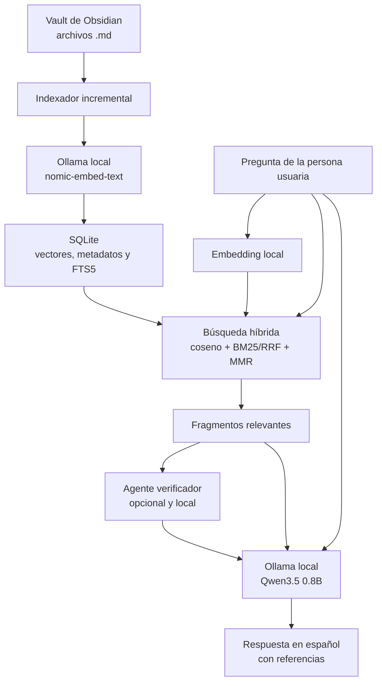

# RAG local para Obsidian con Ollama

Aplicación web local para consultar los archivos Markdown de un vault de
Obsidian. Los embeddings y las respuestas se generan con modelos instalados en
Ollama; no usa OpenAI, claves de API, analítica ni servicios de IA externos.

La aplicación conserva:

- FastAPI y la interfaz web local;
- indexación incremental y reconstrucción atómica del índice;
- fragmentos padre-hijo opcionales: búsqueda precisa con contexto ampliado;
- vectores `float32` en SQLite y matriz semántica en memoria;
- búsqueda híbrida con similitud coseno exacta, FTS5, RRF, MMR y reordenación
  opcional, más una tercera rama de recuperación por grafo;
- grafo de wikienlaces materializado en SQLite, con backlinks, migración desde
  `links_json` y publicación atómica;
- verificador y redactor locales;
- memoria por conversación y memoria compartida entre conversaciones del mismo
  proyecto;
- expansión de enlaces `[[...]]` de Obsidian;
- filtros por estado documental, vigencia temporal y etiquetas;
- streaming SSE con fuentes visibles antes de la respuesta;
- validación de citas antes de guardar;
- respuestas con referencias al archivo y la sección;
- evaluación automática del RAG.

## Privacidad y funcionamiento sin conexión

La aplicación sólo admite `OLLAMA_BASE_URL` con `localhost` o una dirección IP
de loopback, como `127.0.0.1`. Además, rechaza modelos cuyo nombre contenga
`cloud`. Los documentos, preguntas, metadatos y embeddings no se envían a
servicios externos.

La primera instalación necesita Internet para descargar Python, las
dependencias, Ollama y los modelos. Después, la indexación, la recuperación y
la generación se realizan localmente y pueden funcionar sin Internet.

Ollama no se instala ni descarga modelos automáticamente desde esta aplicación.

## Proteccion de la interfaz local

El servidor se ejecuta en `127.0.0.1` y acepta exclusivamente cabeceras
`Host` de loopback (`localhost`, `127.0.0.1` o `::1`). Las rutas que modifican
estado (`POST`, `PUT`, `PATCH` y `DELETE`) rechazan una peticion cuyo `Origin`
no sea el mismo origen local o cuyo `Sec-Fetch-Site` no sea `same-origin` o
`none`. Esto impide que una pagina web externa use el navegador para indexar,
alterar proyectos o enviar consultas en nombre de la persona usuaria.

Las automatizaciones locales sin cabeceras de navegador siguen siendo validas;
un navegador normal si incluye esas senales de procedencia. La aplicacion no
debe exponerse mediante un proxy publico ni enlazarse a una interfaz de red.
Los errores HTTP y SSE se devuelven con mensajes genericos; el detalle tecnico
queda en los registros del proceso.

## Arquitectura



FTS5 recupera coincidencias literales —por ejemplo códigos, siglas, títulos y
términos técnicos— mientras que los embeddings recuperan similitud de
significado. Los rankings se fusionan con **Reciprocal Rank Fusion (RRF)**,
después se diversifican con MMR y pueden reordenarse con un backend local si se
activa `RAG_RERANK`.

Se conserva la abstención: si ningún fragmento supera `RAG_MIN_SIMILARITY`, el
programa devuelve que no hay evidencia suficiente y no consulta al modelo de
chat. `RAG_MIN_RELATIVE_SCORE` es un filtro distinto y no debe leerse como un
segundo mecanismo de abstención: sólo descarta candidatos muy alejados del
mejor resultado y **siempre conserva al menos ese mejor candidato**, así que
nunca por sí solo deja la lista vacía. FTS5 y el grafo complementan y
reordenan la evidencia, pero no desactivan esta salvaguarda.

## Requisitos

- Windows 10 u 11.
- Python 3.11 o 3.12.
- [Ollama para Windows](https://ollama.com/download/windows).
- Un vault de Obsidian con archivos `.md`.

Configuración recomendada para los modelos predeterminados:

- 8 GB de RAM como mínimo práctico;
- 16 GB de RAM para trabajar con más holgura;
- GPU compatible opcional: Ollama también puede ejecutar los modelos en CPU.

`qwen3.5:0.8b` ocupa aproximadamente 1 GB descargado. Es rápido y apto para
equipos modestos, aunque su calidad de síntesis es inferior a la de variantes
mayores. Su ventana publicada es de 256K tokens (262.144 tokens); el RAG no
intenta llenarla, sino que envía únicamente la pregunta y los fragmentos
recuperados.

## Instalación rápida en Windows

### 1. Instalar Ollama y descargar los modelos

Instala Ollama y abre PowerShell:

```powershell
ollama pull qwen3.5:0.8b
ollama pull nomic-embed-text
```

Comprueba que el servicio responde:

```powershell
ollama list
```

Normalmente la aplicación de Ollama inicia el servicio automáticamente. Si no
responde, mantenlo abierto o ejecuta:

```powershell
ollama serve
```

### 2. Arrancar el RAG

Haz doble clic en:

```text
iniciar_windows.bat
```

El script:

1. crea `.venv` si no existe;
2. instala o actualiza las dependencias;
3. crea `.env` a partir de `.env.example` la primera vez, si ese archivo está
   presente;
4. comprueba el comando y el servicio de Ollama;
5. avisa si falta algún modelo, sin descargarlo;
6. abre `http://127.0.0.1:8000`.

El script comprueba también las capacidades del servidor que ya pudiera estar
ocupando el puerto 8000. Si detecta una copia antigua del proyecto, se detiene
con una instrucción clara para cerrarla; así no se muestra por error una UI sin
agentes ni métricas de contexto.

Si Ollama no está disponible, la interfaz web sigue arrancando y muestra el
problema en el panel de estado.

En esta copia local no aparece `.env.example`. Si arrancas desde una copia sin
`.env`, crea el archivo manualmente con el bloque de configuración de esta
sección antes de ejecutar `iniciar_windows.bat`.

### Instalación manual

```powershell
py -3.12 -m venv .venv
.venv\Scripts\Activate.ps1
python -m pip install --upgrade pip
pip install -r requirements.txt
Copy-Item .env.example .env   # si existe en tu copia
notepad .env
python -m app.main
```

La aplicación escucha únicamente en:

```text
http://127.0.0.1:8000
```

## Configuración

Configuración predeterminada de `.env`:

```dotenv
OLLAMA_BASE_URL=http://127.0.0.1:11434
OLLAMA_CHAT_MODEL=qwen3.5:0.8b
OLLAMA_EMBEDDING_MODEL=nomic-embed-text
OLLAMA_TIMEOUT_SECONDS=180

OBSIDIAN_VAULT_PATH=./vault_demo
RAG_DATABASE_PATH=./data/rag_index.sqlite3
RAG_TOP_K=6
RAG_MIN_SIMILARITY=0.30
RAG_MIN_RELATIVE_SCORE=0.62
RAG_CHUNK_SIZE=1800
RAG_CHUNK_OVERLAP=250
RAG_PARENT_CHILD_CHUNKING=false
RAG_PARENT_CHUNK_SIZE=6000
RAG_CHILD_CHUNK_SIZE=700
RAG_CHILD_CHUNK_OVERLAP=100
RAG_MAX_OUTPUT_TOKENS=1800
RAG_EMBEDDING_PREFIX_SCHEME=auto
RAG_MMR=true
RAG_MMR_LAMBDA=0.72
RAG_MAX_CHUNKS_PER_DOCUMENT=3

RAG_HYBRID_SEARCH=true
RAG_HYBRID_RRF_K=60
RAG_HYBRID_SEMANTIC_WEIGHT=1.0
RAG_HYBRID_LEXICAL_WEIGHT=0.8
RAG_HYBRID_CANDIDATE_MULTIPLIER=4

RAG_GRAPH_SEARCH=false
RAG_GRAPH_WEIGHT=0.5
RAG_GRAPH_MAX_HOPS=2
RAG_GRAPH_DECAY=0.5
RAG_GRAPH_BACKLINK_WEIGHT=0.7
RAG_GRAPH_SEED_DOCUMENTS=4
RAG_GRAPH_MAX_CANDIDATES=20

RAG_QUERY_ROUTING=false
RAG_QUERY_ROUTER_RELATIONAL_PATTERNS=se relaciona,relacion entre,relacion con,como afecta,como impacta,impacto en,impacto de,depende de,dependen de,consecuencia de,vinculad,conecta con,conexion entre,flujo entre,cadena de,quien depende,que relacion hay
RAG_QUERY_ROUTER_STRUCTURAL_NOUNS=nodo,proceso,riesgo,rol,indicador,kpi,hallazgo,documento,nota,circuito,fase,etapa
RAG_QUERY_ROUTER_MIN_ENTITY_MENTIONS=2
RAG_QUERY_ROUTER_RELATIONAL_GRAPH_WEIGHT=0.5
RAG_QUERY_ROUTER_HYBRID_GRAPH_WEIGHT=0.25
RAG_QUERY_ROUTER_WEAK_EVIDENCE_MARGIN=0.05

RAG_POSTERIOR_ABSTENTION=false
RAG_POSTERIOR_ABSTENTION_THRESHOLD=0.35

RAG_VERIFIER_ABSTAIN_ON_INSUFFICIENT=false

RAG_VERIFIER_CONTEXT_TOKENS=8192
RAG_WRITER_CONTEXT_TOKENS=16384
RAG_VERIFIER_MAX_OUTPUT_TOKENS=600
OLLAMA_KEEP_ALIVE=30m
RAG_EMBEDDING_WORKERS=3
RAG_STREAMING=true

RAG_RERANK=false
RAG_RERANK_BACKEND=onnx
RAG_RERANK_MODEL=BAAI/bge-reranker-v2-m3
RAG_RERANK_ONNX_MODEL_DIR=./models/bge-reranker-v2-m3-onnx
RAG_RERANK_ONNX_MAX_TOKENS=512
RAG_RERANK_CANDIDATES=12
RAG_RERANK_WEIGHT=0.7
RAG_RERANK_MAX_PASSAGE_CHARS=900
RAG_RERANK_BATCH_SIZE=6

RAG_PROJECT_MEMORY_MAX_CONTEXT_CHARS=6000
RAG_PROJECT_MEMORY_SUMMARY_INTERVAL=10
RAG_PROJECT_MEMORY_SUMMARY_MAX_INPUT_CHARS=40000
RAG_PROJECT_MEMORY_SUMMARY_MAX_TOKENS=700

RAG_MEMORY_SUMMARY_INTERVAL=10
RAG_MEMORY_RECENT_TURNS=4
RAG_MEMORY_MAX_CONTEXT_CHARS=12000
RAG_MEMORY_SUMMARY_MAX_INPUT_CHARS=40000
RAG_MEMORY_SUMMARY_MAX_TOKENS=700
```

Para un vault real, usa barras `/`:

```dotenv
OBSIDIAN_VAULT_PATH=C:/Users/TU_USUARIO/Documents/MiVault
```

`OLLAMA_TIMEOUT_SECONDS=180` permite que la primera carga local tarde. Puedes
aumentarlo en equipos lentos.

### Fragmentos padre-hijo

`RAG_PARENT_CHILD_CHUNKING=true` activa una estrategia de recuperación en dos
niveles:

1. cada sección Markdown se divide primero en fragmentos padre amplios;
2. cada padre se divide en hijos pequeños, que reciben los embeddings y se
   indexan también en FTS5;
3. la búsqueda encuentra el hijo preciso, pero entrega al modelo el padre que
   lo contiene para conservar definiciones, condiciones y excepciones cercanas.

Los valores predeterminados usan padres de hasta 6000 caracteres e hijos de
700 con 100 caracteres de solapamiento. Los límites respetan bloques Markdown
como tablas, listas, callouts y código siempre que sea posible. Un bloque
atómico mayor que el límite no se corta de forma insegura.

Los padres se guardan una sola vez en `chunk_parents`; los hijos conservan una
referencia a ellos. Si varios hijos del mismo padre aparecen entre los
candidatos, se conserva sólo el mejor antes del reranking y MMR. El reranker
evalúa el hijo coincidente y los agentes reciben el contexto padre. Si el
presupuesto obliga a recortarlo, la ventana se centra en el hijo recuperado.
Cuántos hijos de un mismo padre coincidieron (`matched_chunk_ids`) se conserva
como señal de fuerza de la evidencia y se muestra en la interfaz cuando son
más de uno.

Como el modo se fija al indexar (activarlo o desactivarlo dispara
reconstrucción atómica, igual que cambiar `chunker_version`), no existe hoy
una comparación automática de recuperación entre ambos modos como la que
`--compare-strategies` hace para el grafo: requeriría dos índices completos en
paralelo. Antes de activarlo en un vault real: ejecuta
`python -m app.rag.evaluation`, reconstruye el índice con
`RAG_PARENT_CHILD_CHUNKING=true` y vuelve a ejecutar la evaluación. Cada
informe registra en `configuration.chunking` y en la cabecera del `.md` el
modo y los tamaños que lo generaron, así que ambos quedan etiquetados para
compararlos.

El modo está desactivado por defecto para conservar índices existentes.
Activarlo, desactivarlo o cambiar cualquiera de sus tres tamaños modifica la
huella del índice y requiere pulsar **Indexar vault** para ejecutar una
reconstrucción atómica. `RAG_CHUNK_SIZE` y `RAG_CHUNK_OVERLAP` siguen siendo
los valores usados por el modo plano.

### Búsqueda híbrida

`RAG_HYBRID_SEARCH=true` activa dos recuperadores locales:

- **semántico**: producto matricial exacto sobre embeddings normalizados en
  memoria;
- **textual**: SQLite FTS5 con ranking BM25 sobre título, sección, contenido y
  ruta.

La consulta FTS5 se construye con términos normalizados y no interpola sintaxis
introducida por el usuario. En conversaciones con memoria, el embedding utiliza
la consulta enriquecida para resolver referencias como «eso» o «lo anterior»,
pero FTS5 sólo utiliza la pregunta actual para no contaminar sus coincidencias
con palabras del resumen.

Los candidatos se combinan mediante RRF. Los valores predeterminados dan un
peso de `1.0` a la rama semántica y `0.8` a la textual:

- `RAG_HYBRID_RRF_K`: suavizado del ranking RRF;
- `RAG_HYBRID_SEMANTIC_WEIGHT`: peso del orden semántico;
- `RAG_HYBRID_LEXICAL_WEIGHT`: peso del orden textual;
- `RAG_HYBRID_CANDIDATE_MULTIPLIER`: candidatos examinados por cada rama.

`RAG_GRAPH_SEARCH=true` añade una tercera rama RRF. Toma como semillas los
primeros documentos semánticos, recorre wikienlaces y backlinks hasta
`RAG_GRAPH_MAX_HOPS`, aplica `RAG_GRAPH_DECAY` por salto y selecciona en cada
nota alcanzada el fragmento más similar a la pregunta. Los enlaces rotos se
conservan como diagnóstico y la migración del grafo usa los `links_json`
existentes: activarlo no recalcula embeddings ni obliga a reindexar.
`RAG_GRAPH_WEIGHT`, `RAG_GRAPH_BACKLINK_WEIGHT`,
`RAG_GRAPH_SEED_DOCUMENTS` y `RAG_GRAPH_MAX_CANDIDATES` controlan su peso y
amplitud. Con el grafo activo se deshabilita automáticamente la expansión
simple `expand_links`, porque ambas vías recorrerían los mismos enlaces.

El grafo se materializa en `document_links` y se prepara en
`staged_document_links`. La resolución de alias se hace cuando ya están
presentes todas las notas; los enlaces rotos se conservan con destino nulo para
diagnóstico. Las altas, sustituciones y bajas incrementales mantienen las
aristas sincronizadas, y la migración inicial reutiliza `links_json` sin
recalcular embeddings ni modificar la huella del índice vectorial.

La recuperación por grafo conserva la abstención: si la rama semántica no
produce semillas, el grafo no se consulta. Los filtros de estado, vigencia y
etiquetas se reaplican después de hidratar sus candidatos, porque las aristas
no almacenan esos metadatos.

Después de fusionar, MMR reduce la repetición de fragmentos demasiado parecidos
y `RAG_MAX_CHUNKS_PER_DOCUMENT` evita que una sola nota ocupe todo el contexto.
La abstención real depende únicamente de `RAG_MIN_SIMILARITY`;
`RAG_MIN_RELATIVE_SCORE` recorta candidatos lejanos dentro de lo ya aceptado,
nunca vacía el resultado.

`RAG_EMBEDDING_PREFIX_SCHEME=auto` aplica prefijos de tarea para modelos como
`nomic-embed-text`, E5 o BGE. Cambiar el esquema, el modelo, el tamaño de chunk
o el formato del índice dispara reconstrucción atómica.

Los filtros de recuperación disponibles son:

- `status`: estado documental del frontmatter (`estado` o `status`);
- `vigencia`: `vigente`, `futura`, `caducada`, `desconocida` o `no_caducada`;
- `tags`: lista de etiquetas normalizadas, con semántica AND.

### Enrutador de consultas (experimental, desactivado por defecto)

Una ablación sobre 16 preguntas factuales del vault activo mostró que subir el
peso del grafo de 0 a 0,5 para *toda* consulta hunde el MRR de 0,938 a 0,474.
Un peso de compromiso perjudica lo factual para beneficiar lo relacional. La
alternativa es decidir por consulta, no globalmente: `RAG_QUERY_ROUTING=true`
activa un enrutador determinista (sin LLM, en `app/rag/query_routing.py`) que
clasifica cada pregunta como `factual`, `relational`, `hybrid` o `unknown` y
construye una `RetrievalPolicy` inmutable para esa consulta —nunca se muta
`settings`, así que peticiones concurrentes con políticas distintas no se
pisan entre sí—.

Señales auditables (visibles en `reasons` del estado de recuperación):

- expresiones relacionales configurables (`RAG_QUERY_ROUTER_RELATIONAL_PATTERNS`);
- alias o nombres de nota mencionados por su nombre en la propia pregunta
  (mínimo `RAG_QUERY_ROUTER_MIN_ENTITY_MENTIONS`);
- los documentos semilla de la búsqueda semántica ya conectados entre sí en
  el grafo;
- sustantivos estructurales configurables mencionados más de una vez
  (`RAG_QUERY_ROUTER_STRUCTURAL_NOUNS`).

Con 2 o más señales la consulta es `relational` (grafo activo a 1 salto,
`RAG_QUERY_ROUTER_RELATIONAL_GRAPH_WEIGHT`); con exactamente 1 señal es `hybrid`
(igual pero con `RAG_QUERY_ROUTER_HYBRID_GRAPH_WEIGHT`, semántica y texto
conservan su peso configurado); sin señales, o con evidencia semántica débil
(`RAG_QUERY_ROUTER_WEAK_EVIDENCE_MARGIN` por encima de `RAG_MIN_SIMILARITY`),
la política es `factual`/`unknown`: grafo desactivado, igual que si el
enrutador no existiera. El grafo nunca supera 1 salto por defecto aunque
`RAG_GRAPH_MAX_HOPS` esté configurado a más.

`RAG_QUERY_ROUTING=false` (por defecto) es indistinguible del comportamiento
sin enrutador: la política de cada consulta se deriva entonces sólo de
`settings`. Antes de activarlo en un vault real, `python -m app.rag.evaluation
--compare-strategies` compara `graph_off`, `graph_on_1hop`, `oracle` (enrutador
perfecto según `query_type` del dataset) y `router_real` sobre el mismo
conjunto de preguntas: si ni siquiera `oracle` mejora las relacionales frente a
`graph_off`, activar el enrutador real no tiene techo que alcanzar.

Si se activa el enrutador, una consulta relacional puede habilitar el grafo por
consulta aunque `RAG_GRAPH_SEARCH=false`. Para reproducir exactamente el
comportamiento sin grafo, deben mantenerse desactivados tanto
`RAG_GRAPH_SEARCH` como `RAG_QUERY_ROUTING`.

### Abstención posterior y verificador estructurado (infraestructura, desactivadas)

Dos capas adicionales de abstención existen como infraestructura lista pero
sin calibrar, porque no hay todavía un conjunto dorado con suficientes casos
positivos y negativos reales para ajustar sus pesos:

- `RAG_POSTERIOR_ABSTENTION=true` evalúa el conjunto final ya diversificado
  (mejor similitud, margen sobre el segundo candidato, cobertura léxica,
  acuerdo entre ramas, puntuación del reordenador, tamaño del conjunto) y
  puede vaciar la respuesta si la combinación pondera por debajo de
  `RAG_POSTERIOR_ABSTENTION_THRESHOLD`. Ver `app/rag/abstention.py` para el
  detalle de los pesos, marcados explícitamente como heurística inicial.
- `RAG_VERIFIER_ABSTAIN_ON_INSUFFICIENT=true` hace que, si el agente
  verificador existente (no uno nuevo) marca la evidencia como
  `SUFICIENCIA: insuficiente`, el redactor no se invoque y la respuesta sea la
  misma que una abstención. Si el informe del verificador no sigue el formato
  esperado, el sistema no abstiene por eso: es un fallback seguro, no
  evidencia de insuficiencia.

`scripts/calibrate_threshold.py` ahora soporta costes distintos para cada tipo
de error (`--cost-fp` para responder debiendo abstenerse, `--cost-fn` para
abstenerse debiendo responder) y reporta balanced accuracy, precisión/recall
de abstención y una tabla de cobertura frente a exactitud por umbral, en vez
de minimizar sólo el recuento bruto de errores.

### Reordenador ONNX local

El backend predeterminado es `onnx`: usa `bge-reranker-v2-m3` INT8 con
ONNX Runtime en CPU y la cabeza de clasificación real del cross-encoder. No
usa Ollama para puntuar ni instala `torch`. El modelo se descarga una sola vez
de forma explícita y permanece local; las preguntas y los fragmentos no salen
del equipo durante una consulta.

Después de instalar dependencias, descarga el artefacto local:

```powershell
python scripts\download_reranker_onnx.py
```

El script instala únicamente el tokenizador y `onnx/model_quantized.onnx` en
`models/bge-reranker-v2-m3-onnx`. El modelo INT8 ocupa aproximadamente 571 MB
y el tokenizador unos 17 MB; no son decenas de MB. El origen es
[`onnx-community/bge-reranker-v2-m3-ONNX`](https://huggingface.co/onnx-community/bge-reranker-v2-m3-ONNX), una exportación ONNX del modelo
[`BAAI/bge-reranker-v2-m3`](https://huggingface.co/BAAI/bge-reranker-v2-m3).

`RAG_RERANK=true` activa la pasada adicional. Los perfiles **Equilibrado** y
**Calidad** escriben automáticamente `RAG_RERANK=true` y
`RAG_RERANK_BACKEND=onnx`; **Ligero**, Llama 3 y GPT-OSS lo dejan desactivado.
Si falta el modelo o el runtime, se conserva el orden previo y la consulta no
falla. `llm` y `cross_encoder` siguen disponibles sólo como compatibilidad;
este último requiere `sentence-transformers` y `torch`.

### Agentes y contexto por proyecto

Cada proyecto ejecuta un flujo controlado:

1. **Recuperación**: FTS5 y embeddings seleccionan fragmentos sin consultar al
   LLM.
2. **Verificador**: revisa suficiencia, referencias, contradicciones y lagunas.
   Es opcional.
3. **Redactor**: genera la respuesta final usando los fragmentos y el informe
   del verificador.

El verificador y el redactor utilizan el mismo modelo local seleccionado, pero
tienen ventanas `num_ctx` independientes. Los valores iniciales son 8.192 y
16.384 tokens. Se pueden cambiar para cada proyecto desde el panel
**Proyectos** entre 4.096 y 262.144 tokens. `RAG_VERIFIER_CONTEXT_TOKENS` y
`RAG_WRITER_CONTEXT_TOKENS` sólo determinan el valor inicial de proyectos nuevos.

Si el verificador falla, el redactor continúa usando directamente los
fragmentos y la interfaz muestra un aviso. Si no existe evidencia que supere
los umbrales de abstención, no se llama al redactor.

### Inspector de contexto

La aplicación nunca muestra un único número ambiguo llamado «contexto». En su
lugar distingue siempre tres capacidades distintas:

- **Capacidad del modelo** (`model_context_window`): el techo real con el que
  se entrenó o cuantizó el modelo instalado.
- **Ventana configurada** (`configured_context_window`): lo que el proyecto
  pide para el Verificador o el Redactor.
- **Ventana efectiva** (`effective_context_window`): lo que de verdad se envía
  a Ollama como `num_ctx` en esa inferencia, siempre
  `min(configurada, capacidad del modelo)`.

La capacidad del modelo se resuelve con `resolve_model_context()`
(`app/model_profiles.py`) en este orden:

1. Metadatos locales de Ollama (`POST /api/show`), leyendo de forma segura
   cualquier clave `*.context_length` que reporte (valida tipo y rango antes
   de aceptarla). No descarga nada ni contacta ningún servicio externo: sólo
   lee metadatos de un modelo ya instalado.
2. El perfil conocido en `CHAT_MODEL_PROFILES`, si el modelo coincide con uno.
3. Si ambas fuentes existen y no coinciden, se usa el valor más conservador
   (el menor) y se adjunta una advertencia explicando la discrepancia.
4. Si no hay perfil ni metadatos (un modelo personalizado sin instalar, o con
   Ollama apagado), se aplica un límite prudente de 32.768 tokens marcado
   explícitamente como **no verificado**: la interfaz nunca presenta ese
   número como si fuera un dato medido.

Cada inferencia real del Verificador y del Redactor guarda, además de los
tokens de entrada y salida, el modelo utilizado, el perfil (si lo hay), la
capacidad del modelo, la fuente de esa capacidad, la ventana configurada, la
ventana efectiva y si el recuento es medido o estimado. El campo histórico
`context_window_tokens` se conserva por compatibilidad y siempre representa la
ventana efectiva.

En la cabecera, un indicador compacto («Contexto 31% · qwen3.5:2b · 16K/32K»)
resume el uso máximo entre Verificador y Redactor en la última inferencia, la
ventana efectiva configurada y la capacidad máxima conocida del modelo. Al
pulsarlo se abre el **Inspector de contexto**, con cuatro bloques:

- **Modelo activo**: nombre exacto, perfil, capacidad máxima, fuente (perfil,
  Ollama o límite prudente) y si el dato está verificado, con aviso si el
  perfil y Ollama no coinciden.
- **Conversación**: turnos totales almacenados frente a turnos recientes
  incluidos en el próximo prompt, tokens estimados del historial completo,
  del historial activo, del resumen y de la memoria del proyecto, y una
  proyección estimada para la siguiente consulta. Deja explícito que no todo
  el historial guardado entra en cada prompt: la aplicación lo reconstruye en
  cada turno, incorpora como mucho los últimos turnos recientes y puede
  sustituir el resto por un resumen.
- **Verificador** y **Redactor**: estado (activado, desactivado, omitido o con
  error), modelo usado, ventana configurada, ventana efectiva, tokens de
  entrada y salida, margen disponible y una barra de uso con tres niveles
  (seguro <60%, advertencia 60–85%, peligro >85%) que nunca depende sólo del
  color: el texto y el `aria-label` llevan siempre la cifra exacta.

Cada turno del historial conserva un botón «Contexto» que abre el modelo y la
ventana usados **en ese momento**, aunque después hayas cambiado de perfil; un
turno guardado antes de que existiera este detalle se marca como «dato
histórico incompleto» en lugar de mostrar huecos o inventar valores.

La interfaz nunca acumula porcentajes entre turnos ni entre agentes: cada
llamada a Ollama tiene su propia ventana, y una barra de uso siempre
corresponde a una única inferencia. Tampoco emplea la expresión «tokens
restantes del chat»: cada consulta reconstruye el prompt desde cero, así que
el contexto no se «gasta» de forma acumulativa a lo largo de la conversación.

Si Ollama no informa contadores exactos, la telemetría usa el mismo estimador
centralizado del resto de la aplicación (~4 caracteres por token) y lo marca
como `estimated: true`. En modelos de razonamiento como GPT-OSS, el
razonamiento oculto no llega nunca al texto visible, pero si Ollama lo incluye
en `eval_count` la aplicación no lo resta: ocupó contexto real y debe contarse
igual.

### Perfiles del modelo de respuesta

El panel **Estado** permite cambiar el modelo sin editar `.env`:

| Perfil | Modelo | Orientación |
|---|---|---|
| Ligero | `qwen3.5:0.8b` | Más rápido; 8 GB de RAM recomendados |
| Equilibrado | `qwen3.5:2b` | Mejor comprensión; ONNX reranker activo; 8-12 GB |
| Calidad | `qwen3.5:4b` | Mejor síntesis; ONNX reranker activo; 12-16 GB |
| Qwen3 14B | `qwen3:14b` | Modelo denso mayor con razonamiento propio activable; 16-20 GB |
| Llama 3 | `llama3:latest` | Buen castellano, contexto corto de 8K |
| GPT-OSS | `gpt-oss:latest` | Contexto amplio de 128K y razonamiento propio |

La selección se guarda como `OLLAMA_CHAT_MODEL` y se aplica a la siguiente
respuesta. También actualiza el estado de reranking del perfil. Cambiar el
modelo de chat no modifica los embeddings y no requiere reconstruir el índice.

Cada perfil declara su ventana real de contexto, contrastada además con los
metadatos locales de Ollama cuando están disponibles (ver «Inspector de
contexto» más abajo). Los valores guardados en un proyecto se recortan al
usarlos, no al guardarlos: si un proyecto conserva 32K y cambias a Llama 3, el
agente trabaja dentro de 8K. Al cambiar de perfil la interfaz actualiza de
inmediato la capacidad mostrada y recalcula las ventanas efectivas futuras;
nunca reescribe las métricas de turnos ya guardados con el modelo nuevo. Los
modelos personalizados usan los metadatos de Ollama si están instalados, o si
no, un techo prudente de 32K marcado como no verificado.

`gpt-oss` usa `think="low"` porque razona por diseño. El razonamiento no se
muestra en la interfaz.

La aplicación no descarga modelos al seleccionar un perfil. Instala antes los
que quieras utilizar:

```powershell
ollama pull qwen3.5:0.8b
ollama pull qwen3.5:2b
ollama pull qwen3.5:4b
ollama pull qwen3:14b
ollama pull llama3
ollama pull gpt-oss
```

Las descargas publicadas son aproximadamente 2,7 GB para Qwen 2B y 3,4 GB para
Qwen 4B; Qwen3 14B ronda los 9 GB en su cuantización por defecto. Llama 3 y
GPT-OSS dependen de la variante publicada por Ollama. Como orientación, 8–12
GB de RAM resultan razonables para Qwen 2B, 12–16 GB para Qwen 4B y 16–20 GB
para Qwen3 14B, además de la memoria que necesiten Windows y otras
aplicaciones.

Si cambias el modelo de embeddings, descárgalo primero y actualiza
`OLLAMA_EMBEDDING_MODEL`. El programa detectará el cambio y reconstruirá el
índice.

## Uso

1. Abre la aplicación.
2. Comprueba en **Estado** que Ollama y ambos modelos están disponibles.
3. Si necesitas cambiar de carpeta, pulsa **Elegir vault** y selecciónala en
   la ventana de Windows. La ruta se guarda en `.env` inmediatamente.
4. Selecciona el perfil de respuesta.
5. En **Proyectos**, selecciona **General** o pulsa **+** para crear y nombrar
   otro proyecto.
6. Pulsa **Indexar documentos** y espera a que termine el progreso.
7. Escribe una pregunta.
8. Ajusta estado, vigencia, etiquetas y expansión de enlaces si procede.
9. Pulsa **Preguntar**.

Después de la primera pregunta, la interfaz adopta un formato de chat: el
compositor permanece en la parte inferior y cada pregunta, respuesta y conjunto
de fuentes se añade al hilo. La barra lateral permite abrir conversaciones
anteriores, empezar una nueva o borrar una existente. Los proyectos funcionan
como carpetas locales para agrupar esos hilos: pulsa un proyecto para ver sólo
sus conversaciones, usa el icono de lápiz para renombrarlo y el botón de
eliminación para quitarlo. Al borrar un proyecto, sus conversaciones pasan a
**General**. La selección queda recordada en ese navegador.

El proyecto activo muestra una configuración compacta de agentes: nombre,
ventana de contexto y porcentaje disponible para Verificador y Redactor.
La verificación y la memoria compartida se activan o desactivan desde
**Opciones**. Cambiar estos límites no requiere reconstruir el índice documental.

La barra lateral usa tipografía del sistema, secciones planas y controles con
una jerarquía visual común en escritorio y móvil. Los datos secundarios de uso
siguen disponibles en la traza de cada respuesta sin recargar la navegación.
El filtro de etiquetas se presenta como un selector compacto con búsqueda,
selección múltiple, número de documentos por etiqueta y una acción para limpiar
la selección.

El historial se guarda exclusivamente en el mismo SQLite local. Incluye
preguntas, respuestas, modelo utilizado y referencias documentales. Borrar una
conversación elimina también todos sus turnos y su memoria.

### Memoria conversacional

Cada conversación puede utilizar memoria propia. El control **Usar memoria de
este hilo** permite activarla o desactivarla sin borrar el historial ni los
resúmenes existentes. La preferencia se conserva por conversación.

Cuando está activa, cada consulta recibe:

- el resumen acumulado de la conversación, si ya existe;
- hasta los últimos cuatro turnos, ajustados al límite de contexto;
- los fragmentos recuperados del vault;
- la pregunta actual.

Cada diez turnos completos —un turno es una pregunta con su respuesta— Ollama
genera localmente un nuevo resumen acumulativo a partir del resumen anterior y
del siguiente bloque de diez turnos. El resumen y el punto hasta el que se ha
procesado se guardan en `conversation_memory`, dentro del mismo SQLite.

La documentación recuperada tiene prioridad sobre la memoria: el resumen sirve
para interpretar referencias como «¿y después?» pero no cuenta como evidencia
documental. Si falla la generación del resumen, la respuesta y el turno ya
guardados se conservan, se muestra un aviso y el resumen puede reintentarse en
una consulta posterior. Si ningún fragmento supera el umbral de similitud, se
mantiene el comportamiento seguro y no se consulta al modelo, tampoco para
resumir.

Los límites pueden ajustarse con las variables `RAG_MEMORY_*`. Para el modelo
de 0,8B se recomiendan los valores predeterminados: resumen cada 10 turnos,
hasta cuatro turnos recientes y 700 tokens como máximo para el resumen.

### Memoria compartida del proyecto

Además de la memoria independiente de cada hilo, cada proyecto puede mantener
un resumen compartido. Cada diez turnos acumulados entre todas sus
conversaciones, Ollama integra objetivos, decisiones, criterios, preferencias y
preguntas abiertas en `project_memory`, dentro del mismo SQLite.

El redactor y el verificador pueden usar ese resumen para interpretar la
intención del proyecto, pero nunca como evidencia documental. Las citas siguen
procediendo exclusivamente de los fragmentos recuperados. Desactivar esta
memoria no borra el resumen existente y puede volver a activarse posteriormente.
Al borrar una conversación se invalida el resumen compartido del proyecto para
garantizar que el contenido eliminado no permanezca dentro de esa memoria; se
reconstruirá a partir de los turnos que sigan existiendo.

Al actualizar una base de datos creada por una versión anterior, las
conversaciones existentes se asignan automáticamente al proyecto **General**.
La migración conserva los hilos y sus turnos. Los proyectos existentes reciben
verificación activa, memoria compartida activa y ventanas de 8K/16K. Los turnos
anteriores aparecen como «sin datos» porque Ollama
todavía no había registrado telemetría de contexto para ellos.

El modelo recibe exclusivamente las instrucciones documentales, la pregunta y
los fragmentos recuperados. Se le pide responder en español, citar referencias,
no usar conocimiento externo, reconocer la falta de evidencia y no mostrar
razonamiento interno.

## Notas y enlaces de Obsidian

El indexador interpreta frontmatter YAML y estos enlaces:

```markdown
[[Otra nota]]
[[Otra nota|texto visible]]
[[Otra nota#Sección]]
![[Otra nota]]
```

También interpreta:

- etiquetas en frontmatter o cuerpo (`tags`, `#sicc-2025`);
- callouts de Obsidian, incluidos avisos de derogación;
- anclas de bloque `^identificador`;
- transclusiones `![[...]]`, separadas de los enlaces normales.

Ejemplo de frontmatter:

```markdown
---
titulo: Cáncer de intervalo
tipo: definición
estado: vigente
tags: [sicc-2025, protocolo]
version: "1.2"
fecha_vigencia: 2026-01-01
fecha_derogacion:
fecha_revision: 2026-07-15
fuente: Protocolo PDPCM
---
```

Los campos son libres. El filtro de estado busca `estado` o `status`. La
vigencia temporal admite variantes como `fecha_vigencia`, `fecha_derogacion`,
`valid_from` o `valid_until`. Si no hay fechas, el documento queda como
`desconocida` y no se oculta por defecto.

## Índice incremental y reconstrucción

SQLite almacena los documentos, padres, fragmentos hijos, enlaces, vectores y
un índice virtual FTS5. La huella de configuración del índice vectorial
incluye:

- versión del formato;
- ruta del vault;
- proveedor de embeddings (`ollama`);
- modelo de embeddings;
- esquema de prefijos de embeddings;
- dimensión real obtenida del modelo;
- tamaño y solapamiento de fragmentos;
- modo padre-hijo y sus tamaños, cuando está activado;
- versión del troceador estructural.

Antes de indexar se obtiene un embedding local de prueba para conocer la
dimensión real. Si cambia el proveedor, el modelo o la dimensión, la
reconstrucción se prepara en tablas separadas mientras el índice activo
permanece intacto. Sólo cuando todos los documentos, padres y fragmentos hijos
están listos, una única transacción SQLite sustituye el índice y su huella. Si
Ollama, un archivo o la activación fallan, SQLite descarta la preparación y conserva el
índice anterior. FTS5 se sustituye dentro de esa misma transacción, por lo que
nunca se publica una reconstrucción con el índice textual a medias. Los
embeddings continúan almacenándose únicamente en los fragmentos hijos.

Para archivos no modificados se conserva el índice usando su SHA-256. También
se eliminan del índice las notas borradas y se ignoran `.obsidian` y otras
carpetas ocultas.

Al arrancar por primera vez una versión que cambia formato, troceador o esquema
de prefijos, la reconstrucción completa se dispara de forma atómica. Las
posteriores altas, sustituciones y bajas de documentos mantienen ambos índices
sincronizados.

## Estado y API

Documentación interactiva:

```text
http://127.0.0.1:8000/docs
```

Rutas:

```text
GET  /health
GET  /api/status
POST /api/config/chat-profile
POST /api/vault/select
POST /api/index
POST /api/index/start
GET  /api/index/progress
POST /api/query
POST /api/query/stream
GET  /api/projects
POST /api/projects
PATCH /api/projects/{id}
DELETE /api/projects/{id}
PATCH /api/projects/{id}/agent-settings
GET  /api/conversations?project_id={id}
GET  /api/conversations/{id}
GET  /api/conversations/{id}/context
PATCH /api/conversations/{id}/memory
DELETE /api/conversations/{id}
```

`/api/status` informa de la URL local, accesibilidad y versión de Ollama,
modelos seleccionados, instalación de cada modelo, estado del índice y modo de
recuperación. La sección `retrieval.fts5` muestra disponibilidad, versión,
fragmentos indexados y sincronización. La comprobación de Ollama usa un timeout
corto y no carga los modelos.
La sección `retrieval.graph` informa de aristas totales, resueltas y rotas,
documentos huérfanos, parámetros activos y si la expansión simple de enlaces
queda sustituida por el recuperador de grafo.
`/api/status` también incluye `model_context`: la capacidad resuelta del
modelo activo (modelo, perfil, ventana, fuente, si está verificada y avisos de
conflicto perfil/Ollama), la misma información que alimenta el indicador de
contexto de la cabecera.

`POST /api/query` y `POST /api/query/stream` aceptan `status`, `vigencia`,
`tags`, `expand_links`, `conversation_id`, `project_id` y `use_memory`. Ambas
vías devuelven en `agents` la misma estructura de telemetría por rol
(modelo, ventanas, tokens, fuente de la capacidad y si el recuento es
estimado), sin diferencias entre la respuesta síncrona y el flujo SSE.

`GET /api/projects` incluye la configuración de agentes, el estado de la
memoria compartida y las métricas agregadas de contexto. Los turnos devueltos
por `GET /api/conversations/{id}` incluyen `agent_metrics`, normalizado al
leerlo: un turno guardado antes de que existiera este detalle se marca con
`incomplete_context_data: true` en vez de mostrar huecos, sin reescribir nunca
el dato original ni migrar la base de datos.

`GET /api/conversations/{id}/context` agrega, para una conversación: el
modelo activo resuelto, turnos totales almacenados frente a turnos recientes
que realmente entran en el próximo prompt, tokens estimados del historial
completo, del resumen y de la memoria del proyecto, el uso máximo de la
última inferencia (sin sumar turnos distintos) y una proyección estimada para
la siguiente consulta. Es la fuente de datos del panel «Inspector de
contexto» de la interfaz.

## Pruebas

Las pruebas unitarias simulan la API HTTP de Ollama y no requieren que Ollama
esté instalado:

```powershell
python -m pytest tests -q
node tests/test_sse_parser.mjs
node tests/test_ui_dom.mjs
```

Cubren embeddings, lotes y orden, dimensión, generación sin razonamiento
interno, errores de conexión, modelos ausentes, estado, proyectos, migración
del historial, memoria acumulativa, tolerancia a fallos del resumen, búsqueda
híbrida, filtros FTS5, grafo de enlaces, resolución de alias, backlinks,
propagación a varios saltos, filtros posteriores y reconstrucción atómica del
índice, límites `num_ctx` por agente, tolerancia a fallos del verificador,
telemetría de tokens, memoria compartida del proyecto, perfiles de modelo,
reranking, filtros de vigencia y etiquetas, validación de citas, parser SSE,
DOM de la interfaz y ajustes de agentes por proyecto.

El inspector de contexto añade su propia cobertura: resolución de capacidad
para los perfiles conocidos, lectura de `context_length` desde metadatos
simulados de Ollama (incluida una clave inválida o fuera de rango), el
fallback prudente de 32K para modelos desconocidos, el criterio conservador
cuando el perfil y Ollama no coinciden, que la ventana efectiva respeta el
modelo activo, que el Verificador y el Redactor guardan modelo/capacidad/
ventana efectiva, paridad exacta entre la respuesta síncrona y el flujo SSE,
contadores ausentes marcados como estimados, que GPT-OSS conserva los tokens
de razonamiento contabilizados por Ollama, que los turnos antiguos siguen
cargando sin migraciones destructivas, que cambiar de modelo no altera
métricas históricas, que el endpoint de contexto de conversación diferencia
historial almacenado de historial activo y que nunca suma porcentajes de
turnos distintos.

En el árbol actual hay 217 pruebas Python. `tests/test_sse_parser.mjs` añade 7
casos del parser SSE (incluida la telemetría de contexto) y
`tests/test_ui_dom.mjs` carga la interfaz en un DOM real y comprueba también
el indicador de contexto, sus diálogos y que la interfaz no use `innerHTML`;
este último requiere `jsdom`.

## Evaluación automática

Después de indexar el vault configurado:

```powershell
python -m app.rag.evaluation
```

Para evaluar también el contenido de las respuestas locales:

```powershell
python -m app.rag.evaluation --generate-answers
```

El conjunto dorado de demostracion esta en `evaluations/questions.json`. Para
evaluar el vault PDPCM indexado se incluye un conjunto inicial separado:

```powershell
python -m app.rag.evaluation --dataset evaluations/pdpcm_questions.json
```

La comparacion sobre 16 casos del vault PDPCM obtuvo 100% de recuperacion
exacta, 100% de recall y MRR 0,938 sin el antiguo agente de scope. Al activarlo
no vario ninguna metrica y anadio 0,53 s de media por pregunta tras
calentamiento; por ese motivo se retiro de la aplicacion.

Los informes se guardan en `evaluations/reports/latest.json` y `latest.md`. La
segunda modalidad necesita Ollama y el modelo de chat instalados, pero no
consume una API externa. Cada informe registra en `configuration.chunking`
(y en la cabecera del `.md`) el modo de troceado activo —plano o padre-hijo,
con sus tamaños— para poder comparar dos informes generados antes y después
de reconstruir el índice con otro modo; ver «Fragmentos padre-hijo» más
arriba.

La comparación específica del grafo se ejecuta sobre el mismo conjunto de
preguntas con:

```powershell
python -m app.rag.evaluation --compare-strategies
```

El informe de referencia está en
`evaluations/reports/graph_comparison.md` y separa preguntas factuales de
relacionales, comparando el grafo apagado y encendido. Ese informe fue generado
el 29/07/2026 sobre un índice anterior; la densidad del índice configurado se
debe leer de la comprobación más reciente siguiente.

### Densidad del grafo del índice configurado

Comprobación del 04/08/2026 sobre la base activa:

- 198 notas;
- 1.453 enlaces resueltos y 153 enlaces rotos;
- media de 7,34 enlaces resueltos por nota;
- mediana de 6 enlaces por nota;
- máximo de 61 enlaces salientes en `03_Procesos/34_Mapa_de_nodos.md`.

La densidad media permite que el grafo aporte señal, pero el nodo con 61
enlaces puede hacer que dos saltos alcancen demasiado contexto. La
configuración prudente es probar primero `RAG_GRAPH_MAX_HOPS=1` y comparar
contra un conjunto de preguntas relacionales del vault antes de dejar dos
saltos activos.

## Limitaciones

- Un modelo de 0,8B puede resumir y citar, pero tiene más riesgo de omisiones o
  redacción deficiente que modelos mayores.
- FTS5 escala bien para la rama textual. La rama semántica sigue siendo exacta
  y calcula un producto matricial NumPy sobre todos los fragmentos cargados en
  memoria; para vaults de cientos de miles de fragmentos convendría valorar un
  índice ANN.
- No hay autenticación, permisos por usuario, auditoría clínica, OCR de PDF ni
  sincronización en tiempo real.
- Los resúmenes conversacionales pueden omitir matices; los últimos turnos se
  incluyen completos para reducir ese riesgo.
- Cada actualización de resumen añade una inferencia local adicional cada diez
  turnos y puede tardar más con el perfil de mayor calidad.
- La verificación y el reranking añaden inferencias locales. La verificación
  puede desactivarse por proyecto; reranking viene desactivado por defecto.
- Aumentar `num_ctx` (la ventana configurada de un agente) no aumenta la
  capacidad con la que se entrenó el modelo: si pides más de lo que el modelo
  soporta, la aplicación lo recorta a la capacidad real antes de llamar a
  Ollama, mostrando esa ventana efectiva en el inspector de contexto. Sí puede
  aumentar considerablemente el uso de RAM/VRAM de Ollama; 262K es un límite
  máximo configurable, no una recomendación para todos los equipos. Tampoco
  implica que toda la conversación se envíe al modelo: sólo entran el resumen
  y los últimos turnos recientes, nunca el historial completo. Y no requiere
  reconstruir el índice documental: es independiente de la indexación.
- La capacidad de un modelo personalizado sin perfil propio depende de que
  Ollama exponga `context_length` en sus metadatos; si el modelo no está
  instalado o Ollama no responde, se usa el límite prudente de 32K marcado
  como no verificado, que puede ser menor que la capacidad real del modelo.
- Los proyectos agrupan conversaciones, pero no crean índices ni vaults
  distintos: todos consultan el vault activo.
- Esta copia no contiene `.env.example`, aunque el script de Windows lo
  referencia para una primera instalación sin `.env`.
- La aplicación no debe exponerse directamente a una red ni utilizarse con
  datos sanitarios identificables sin una revisión completa de seguridad,
  protección de datos, validación clínica y control de accesos.
